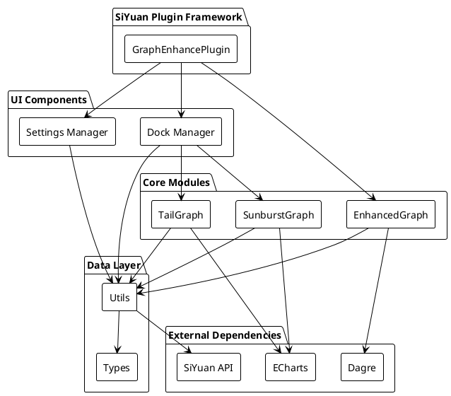
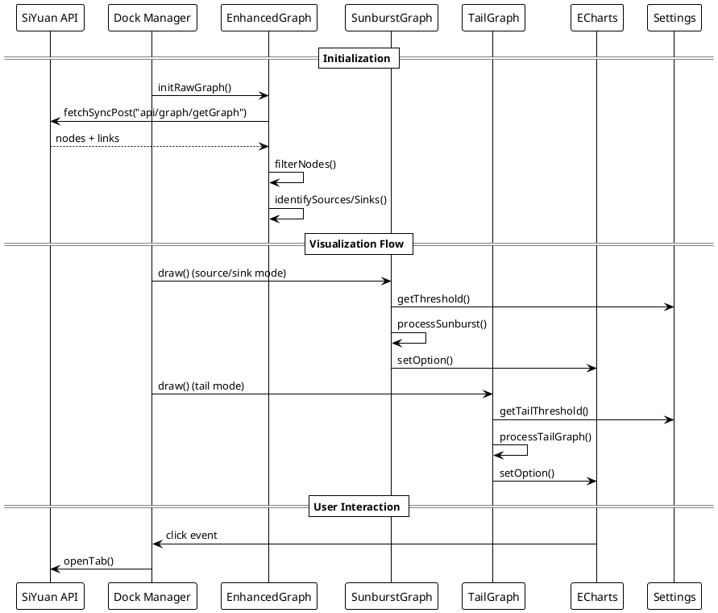
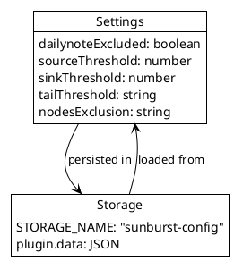

# Development Log

## Project Architecture Overview

### Project Summary

The **Note Sunburst** plugin is a SiYuan note-taking application extension that provides enhanced graph visualization capabilities. It transforms note relationships into interactive sunburst charts and tail graphs, helping users visualize knowledge connections and document hierarchies.

### Overall Architecture

### Module Structure

#### 1. Main Plugin (`index.ts`)

- **Purpose**: Entry point and plugin lifecycle management
- **Key Responsibilities**:
  - Plugin initialization and configuration
  - Default settings management
  - Icon registration
  - Component coordination

#### 2. Graph Management (`graph.ts`)

- **Purpose**: Core graph data processing and management
- **Key Responsibilities**:
  - Raw graph initialization from SiYuan API
  - Node filtering (daily notes, excluded patterns)
  - Graph preprocessing for visualization
  - Integration with Dagre for graph algorithms

#### 3. Visualization Components

##### Sunburst Graph (`sunburst-graph.ts`)

- **Purpose**: Hierarchical sunburst chart visualization
- **Key Features**:
  - Source-focused visualization (outgoing links)
  - Sink-focused visualization (incoming links)
  - Multi-level hierarchy generation (3 levels deep)
  - Interactive node navigation
  - Threshold-based filtering

##### Tail Graph (`tail-graph.ts`)

- **Purpose**: Connected components visualization
- **Key Features**:
  - Component detection using graph algorithms
  - Force-directed layout
  - Size-based filtering
  - Circular edge creation for components

#### 4. UI Management

##### Dock Manager (`dock.ts`)

- **Purpose**: Plugin UI container and interaction handling
- **Key Features**:
  - Dock panel creation and management
  - View switching (source/sink/tail)
  - Refresh functionality
  - Event handling

##### Settings Manager (`settings.ts`)

- **Purpose**: Plugin configuration management
- **Key Settings**:
  - Daily note exclusion
  - Source/sink thresholds
  - Tail graph size bounds
  - Node exclusion patterns

#### 5. Utilities (`utils.ts`)

- **Purpose**: Shared utilities and global state
- **Key Features**:
  - ECharts instance management
  - Plugin reference handling
  - Internationalization support
  - Graph state management

#### 6. Type Definitions (`types.ts`)

- **Purpose**: TypeScript type definitions
- **Key Types**:
  - `DagreOutput`: Graph algorithm output structure
  - `DagreNodeValue`: Node metadata structure

### Data Flow Architecture

### Key Design Decisions

#### 1. **Modular Architecture**

- **Rationale**: Separation of concerns for maintainability
- **Implementation**: Each visualization type has its own class
- **Benefits**: Easy to extend with new visualization types

#### 2. **Graph Processing Pipeline**

- **Stages**: Raw Data → Filtering → Processing → Visualization
- **Design**: Centralized graph processing in `EnhancedGraph`
- **Advantage**: Consistent data across all visualizations

#### 3. **Threshold-Based Filtering**

- **Purpose**: Prevent information overload in large graphs
- **Implementation**: Configurable thresholds for different visualization types
- **Flexibility**: User-adjustable via settings

#### 4. **ECharts Integration**

- **Choice**: ECharts for powerful, interactive visualizations
- **Benefits**: Rich interaction, responsive design, click handling
- **Architecture**: Shared ECharts instance managed by utils

#### 5. **SiYuan API Integration**

- **Method**: Direct API calls for graph data
- **Data Structure**: Leverages SiYuan's built-in graph capabilities
- **Optimization**: Caching and selective updates

### Technology Stack

- **Frontend**: TypeScript, SCSS
- **Visualization**: ECharts (Sunburst, Graph charts)
- **Graph Processing**: Dagre.js
- **Plugin Framework**: SiYuan Plugin API
- **Build System**: Implicit (SiYuan plugin build)

### Configuration Management

### Internationalization Support

- **Files**: `src/i18n/en_US.json`, `src/i18n/zh_CN.json`
- **Integration**: SiYuan's built-in i18n system
- **Coverage**: UI labels, tooltips, error messages

### Performance Considerations

- **Graph Caching**: Raw graph data cached after initial load
- **Lazy Loading**: Visualizations generated on-demand
- **Threshold Filtering**: Prevents rendering of overly complex graphs
- **Component Detection**: Efficient algorithms for connected components

### Extension Points

- **New Visualization Types**: Add new classes following SunburstGraph pattern
- **Custom Filters**: Extend node filtering logic in EnhancedGraph
- **Additional Settings**: Add new configuration options in settings.ts
- **UI Enhancements**: Modify dock.ts for new UI components
